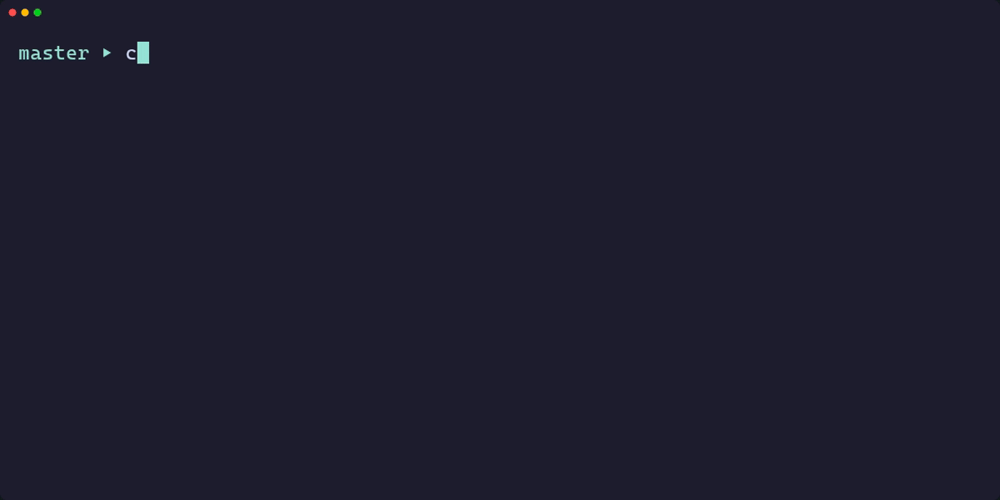
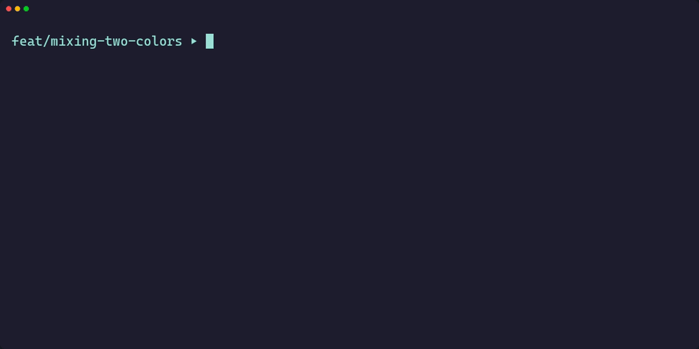

<div align="center">


**AI-powered commits, branches, and pull requests.**

[](https://crates.io/crates/committer-cli)
[](LICENSE)
[](https://www.rust-lang.org/)
[](https://github.com/nolanneff/committer/releases)

[Installation](#installation) • [Quick Start](#quick-start) • [Usage](#usage) • [Configuration](#configuration)

</div>

---

A fast, simple, lightweight CLI that automates your git workflow. Generate commit messages, detect branch misalignment, create feature branches, and open pull requests—all powered by AI.

Most AI commit tools are built on Node.js or Python, adding noticeable startup delay to every invocation. Committer is a native binary—it launches instantly and streams responses in real-time, so you're never waiting on the tool itself.

---

## What It Does

### Commit Messages

Generate conventional commits from your staged changes:

<p align="center">

</p>

### Branch Detection

Catch mistakes before they happen. Committer analyzes your changes and warns if they don't match your current branch:

<p align="center">

</p>

### Pull Requests

Generate PR titles and descriptions from your commits, then create the PR:

<p align="center">

</p>

## Features

- **Conventional commits** — Properly formatted `type(scope): description` messages
- **Fast** — Starts instantly, streams responses in real-time
- **Smart diff filtering** — Automatically excludes lock files, build artifacts, minified code
- **Large diff handling** — Intelligently truncates at 300KB to stay within limits
- **Any model** — Use Claude, GPT-4, Gemini, Llama, or any model on OpenRouter

## Installation

### From crates.io

```bash
cargo install committer-cli
```

### From source

```bash
git clone https://github.com/nolanneff/committer.git
cd committer
cargo install --path .
```

### Pre-built binaries

Download from the [releases page](https://github.com/nolanneff/committer/releases).

## Quick Start

1. **Get an API key** from [OpenRouter](https://openrouter.ai/keys)

2. **Set your API key:**
   ```bash
   export OPENROUTER_API_KEY="sk-or-..."
   ```

   Add to your shell profile (`~/.bashrc`, `~/.zshrc`) to persist across sessions.

3. **Generate your first commit:**
   ```bash
   git add .
   committer
   ```

## Usage

### Commits

```bash
committer              # Generate message, prompt for confirmation
committer -a           # Stage all changes first
committer -y           # Skip confirmation, commit immediately
committer -ay          # Stage all + auto-commit (fully automatic)
committer -d           # Dry run, preview message only
committer -o           # Generate single-line message (no body)
committer -m <model>   # Use a specific model
committer -v           # Show verbose output
```

### Branches

```bash
committer -b           # Analyze branch alignment, prompt to create
committer -B           # Auto-create suggested branches
```

### Pull Requests

```bash
committer pr              # Create PR with AI-generated title/description
committer pr --draft      # Create as draft
committer pr -d           # Preview without creating
committer pr -y           # Create without confirmation
committer pr --base main  # Specify base branch (auto-detected by default)
committer pr -m <model>   # Use a specific model
```

**Requires:** [GitHub CLI](https://cli.github.com/) (`gh auth login`)

### Branch Cleanup

```bash
committer clean          # Review and delete safely merged local branches
committer clean -d       # Preview without switching or deleting
committer clean -v       # Show base-branch and GitHub lookup details
```

Cleanup uses Git ancestry plus merged GitHub PR head SHAs, so it recognizes squash/rebase merges without deleting branches that gained newer commits. It only deletes local branches; if GitHub CLI is unavailable, it safely falls back to Git ancestry.

## Configuration

Configuration is **optional**. Committer works out of the box with sensible defaults. Customize only what you need.

Config file: `~/.config/committer/config.toml`

### Commands

```bash
committer config show                     # View current settings
committer config model <model>            # Set default model
committer config auto-commit true         # Skip confirmations
committer config commit-after-branch true # Auto-commit after creating branch
committer config verbose true             # Enable debug output
```

### Options

| Option | Default | Description |
|--------|---------|-------------|
| `model` | `google/gemini-3-flash-preview` | Default model |
| `auto_commit` | `false` | Skip confirmation prompts |
| `commit_after_branch` | `false` | Auto-commit after creating branch via `b` option |
| `verbose` | `false` | Show detailed logs |

### Environment variables

- `OPENROUTER_API_KEY` — API key (required)
- `EDITOR` — Editor for commit message editing (optional)

#### Windows note

Windows 11's new tabbed Notepad has issues saving temp files when using the `[e] Edit` option. It may open "Save As" to the wrong directory instead of saving in place.

Set the `EDITOR` environment variable to a different editor like VS Code, Notepad++, or classic Notepad (`C:\Windows\notepad.exe`).

## Requirements

- Git
- [OpenRouter API key](https://openrouter.ai/keys) (free tier available)
- [GitHub CLI](https://cli.github.com/) (required for `committer pr`, optional for PR-aware `committer clean`)

## Roadmap

This project is under active development. Planned features:

- [ ] Custom commit message formatting (templates, scopes, styles)
- [ ] More configuration options

## Contributing

1. Fork the repo
2. Create a feature branch (`git checkout -b feat/my-feature`)
3. Commit using conventional commits (Could use committer 🙂)
4. Open a PR against `main`

## License

MIT © [Nolan Neff](https://github.com/nolanneff)


